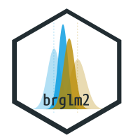

<!-- README.md is generated from README.Rmd. Please edit that file -->

brglm2 
=======================================================================

<!-- badges: start -->

<!-- badges: end -->

[**brglm2**](https://github.com/ikosmidis/brglm2) provides tools for the
estimation and inference from generalized linear models using various
methods for bias reduction. **brglm2** supports all generalized linear
models supported in R, and provides methods for multinomial logistic
regression (nominal responses) and adjacent category models (ordinal
responses).

Reduction of estimation bias is achieved by solving either the mean-bias
reducing adjusted score equations in [Firth
(1993)](https://doi.org/10.1093/biomet/80.1.27) and [Kosmidis & Firth
(2009)](https://doi.org/10.1093/biomet/asp055) or the median-bias
reducing adjusted score equations in [Kenne et al
(2017)](https://doi.org/10.1093/biomet/asx046), or through the direct
subtraction of an estimate of the bias of the maximum likelihood
estimator from the maximum likelihood estimates as prescribed in
[Cordeiro and McCullagh (1991)](https://www.jstor.org/stable/2345592).
[Kosmidis et al (2020)](https://doi.org/10.1007/s11222-019-09860-6)
provides a unifying framework and algorithms for mean and median bias
reduction for the estimation of generalized linear models.

In the special case of generalized linear models for binomial and
multinomial responses (both ordinal and nominal), the adjusted score
equations return estimates with improved frequentist properties, that
are also always finite, even in cases where the maximum likelihood
estimates are infinite (e.g. complete and quasi-complete separation).
See, [Kosmidis & Firth (2020)](https://doi.org/10.1093/biomet/asaa052)
for the proof of the latter result in the case of mean bias reduction
for logistic regression (and, for more general binomial-response models
where the likelihood is penalized by a power of the Jeffreys’ invariant
prior).

Installation
------------

Install the current version from CRAN:

    install.packages("brglm2")

or the development version from github:

    # install.packages("remotes")
    remotes::install_github("ikosmidis/brglm2", ref = "develop")

Example
-------

Below we follow the example of [Heinze and Schemper
(2002)](https://doi.org/10.1002/sim.1047) and fit a probit regression
model using maximum likelihood (ML) to analyze data from a study on
endometrial cancer (see `?brglm2::endometrial` for details and
references).

    library("brglm2")
    data("endometrial", package = "brglm2")
    modML <- glm(HG ~ NV + PI + EH, family = binomial("probit"), data = endometrial)
    summary(modML)
    #> 
    #> Call:
    #> glm(formula = HG ~ NV + PI + EH, family = binomial("probit"), 
    #>     data = endometrial)
    #> 
    #> Deviance Residuals: 
    #>      Min        1Q    Median        3Q       Max  
    #> -1.47007  -0.67917  -0.32978   0.00008   2.74898  
    #> 
    #> Coefficients:
    #>              Estimate Std. Error z value Pr(>|z|)    
    #> (Intercept)   2.18093    0.85732   2.544 0.010963 *  
    #> NV            5.80468  402.23641   0.014 0.988486    
    #> PI           -0.01886    0.02360  -0.799 0.424066    
    #> EH           -1.52576    0.43308  -3.523 0.000427 ***
    #> ---
    #> Signif. codes:  0 '***' 0.001 '**' 0.01 '*' 0.05 '.' 0.1 ' ' 1
    #> 
    #> (Dispersion parameter for binomial family taken to be 1)
    #> 
    #>     Null deviance: 104.90  on 78  degrees of freedom
    #> Residual deviance:  56.47  on 75  degrees of freedom
    #> AIC: 64.47
    #> 
    #> Number of Fisher Scoring iterations: 17

The ML estimate of the parameter for `NV` is actually infinite, as can
be quickly verified using the
[**detectseparation**](https://cran.r-project.org/package=detectseparation)
R package

    # install.packages("detectseparation")
    library("detectseparation")
    update(modML, method = "detect_separation")
    #> Implementation: ROI | Solver: lpsolve 
    #> Separation: TRUE 
    #> Existence of maximum likelihood estimates
    #> (Intercept)          NV          PI          EH 
    #>           0         Inf           0           0 
    #> 0: finite value, Inf: infinity, -Inf: -infinity

The reported, apparently finite estimate
`r round(coef(summary(modML))["NV", "Estimate"], 3)` for `NV` is merely
due to false convergence of the iterative estimation procedure for ML.
The same is true for the estimated standard error, and, hence the value
0.014 for the *z*-statistic cannot be trusted for inference on the size
of the effect for `NV`.

As mentioned earlier, many of the estimation methods implemented in
**brglm2** not only return estimates with improved frequentist
properties (e.g. asymptotically smaller mean and median bias than what
ML typically delivers), but also estimates and estimated standard errors
that are always finite in binomial (e.g. logistic, probit, and
complementary log-log regression) and multinomial regression models
(e.g. baseline category logit models for nominal responses, and adjacent
category logit models for ordinal responses). For example, the code
chunk below refits the model on the endometrial cancer study data using
mean bias reduction.

    summary(update(modML, method = "brglm_fit"))
    #> 
    #> Call:
    #> glm(formula = HG ~ NV + PI + EH, family = binomial("probit"), 
    #>     data = endometrial, method = "brglm_fit")
    #> 
    #> Deviance Residuals: 
    #>     Min       1Q   Median       3Q      Max  
    #> -1.4436  -0.7016  -0.3783   0.3146   2.6218  
    #> 
    #> Coefficients:
    #>             Estimate Std. Error z value Pr(>|z|)    
    #> (Intercept)  1.91460    0.78877   2.427 0.015210 *  
    #> NV           1.65892    0.74730   2.220 0.026427 *  
    #> PI          -0.01520    0.02089  -0.728 0.466793    
    #> EH          -1.37988    0.40329  -3.422 0.000623 ***
    #> ---
    #> Signif. codes:  0 '***' 0.001 '**' 0.01 '*' 0.05 '.' 0.1 ' ' 1
    #> 
    #> (Dispersion parameter for binomial family taken to be 1)
    #> 
    #>     Null deviance: 104.903  on 78  degrees of freedom
    #> Residual deviance:  57.587  on 75  degrees of freedom
    #> AIC: 65.587
    #> 
    #> Number of Fisher Scoring iterations: 4

A quick comparison of the output from mean bias reduction to that from
ML reveals a dramatic change in the *z*-statistic for `NV`, now that
estimates and estimated standard errors are finite. In particular, the
evidence against the null of `NV` not contributing to the model in the
presence of the other covariates being now stronger.

See `?brglm_fit` and `?brglm_control` for more examples and the other
estimation methods for generalized linear models, including median bias
reduction and maximum penalized likelihood with Jeffreys’ prior penalty.
Also do not forget to take a look at the vignettes
(`vignette(package = "brglm2")`) for details and more case studies.

Solving adjusted score equations using quasi-Fisher scoring
-----------------------------------------------------------

The workhorse function in **brglm2** is
[`brglm_fit`](https://github.com/ikosmidis/brglm2/blob/master/R/brglmFit.R)
(or equivalently `brglmFit` if you like camel case), which, as we did in
the example above, can be passed directly to the `method` argument of
the `glm` function. `brglm_fit` implements a quasi [Fisher
scoring](https://en.wikipedia.org/wiki/Scoring_algorithm) procedure,
whose special cases result in a range of explicit and implicit bias
reduction methods for generalized linear models for more details). Bias
reduction for multinomial logistic regression (nominal responses) can be
performed using the function `brmultinom`, and for adjacent category
models (ordinal responses) using the function `bracl`. Both `brmultinom`
and `bracl` rely on `brglm_fit`.

The [iteration
vignette](https://cran.r-project.org/package=brglm2/vignettes/iteration.html)
and [Kosmidis et al (2020)](https://doi.org/10.1007/s11222-019-09860-6)
present the iteration and give mathematical details for the
bias-reducing adjustments to the score functions for generalized linear
models.

The classification of bias reduction methods into explicit and implicit
is as given in [Kosmidis (2014)](https://doi.org/10.1002/wics.1296).

References and resources
------------------------

**brglm2** was presented by [Ioannis Kosmidis](http://www.ikosmidis.com)
at the useR! 2016 international conference at University of Stanford on
16 June 2016. The presentation was titled “Reduced-bias inference in
generalized linear models” and can be watched online at this
[link](https://channel9.msdn.com/Events/useR-international-R-User-conference/useR2016/brglm-Reduced-bias-inference-in-generalized-linear-models).

Motivation, details and discussion on the methods that **brglm2**
implements are provided in

Kosmidis, I, Kenne Pagui, E C, Sartori N. (2020). Mean and median bias
reduction in generalized linear models. [*Statistics and
Computing*](https://doi.org/10.1007/s11222-019-09860-6) *30*, 43–59.
